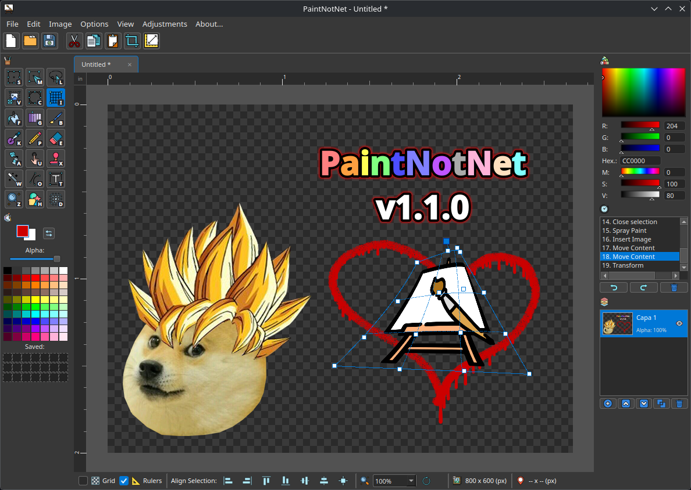

<p align="center">
  
</p>

<h1 align="center">PaintNotNet</h1>

<p align="center">
  <b>Un editor de imágenes liviano, potente y moderno para Linux e inspirado en Paint.NET</b><br>
  <b>A lightweight, powerful, and modern image editor for Linux inspired by Paint.NET</b>
</p>

<p align="center">
  <a href="https://github.com/adrianandin0/PaintNotNet/stargazers"></a>
  <a href="https://github.com/adrianandin0/PaintNotNet/issues"></a>
  <a href="https://github.com/adrianandin0/PaintNotNet/blob/main/LICENSE"></a>
  <a href="https://x.com/adrian_and_ino"></a>
</p>

<p align="center">
  
</p>

---

## Índice / Table of Contents
- [Acerca del Proyecto (Español)](#acerca-del-proyecto-español)
- [About the Project (English)](#about-the-project-english)
- [Guía Paso a Paso de Instalación / Step-by-Step Installation Guide](#guía-paso-a-paso-de-instalación--step-by-step-installation-guide)
  - [Instalación en Linux (Paso a Paso)](#instalación-en-linux-paso-a-paso)
  - [Instalación en Windows (Paso a Paso)](#instalación-en-windows-paso-a-paso)
  - [Ejecución Directa desde Código Fuente](#ejecución-directa-desde-código-fuente)
- [Resolución de Problemas Frecuentes / Troubleshooting](#resolución-de-problemas-frecuentes--troubleshooting)
- [Colaboración / Contributing](#colaboración--contributing)
- [Autor y Contacto / Author & Contact](#autor-y-contacto--author--contact)
- [Créditos / Credits](#créditos--credits)

---

## Acerca del Proyecto (Español)

**PaintNotNet** es una aplicación de edición de imágenes desarrollada en Python 3 y PyQt6. Diseñada para ofrecer una experiencia fluida, rápida y familiar para usuarios que buscan una alternativa intuitiva a software como Paint.NET en entornos Linux y Windows.

### Características Principales

#### Soporte Multi-Idioma (i18n)
- **Cambio de Idioma en Vivo**: Soporte nativo para **Español** e **Inglés**. Permite alternar el idioma de menús, herramientas y diálogos instantáneamente sin reiniciar desde *Opciones -> Preferencias de usuario*.
- **Instalador Interactivo en Linux**: `install.sh` consulta el idioma deseado al inicio y pre-configura la aplicación automáticamente.

#### Herramientas de Dibujo, Selección y Formas
- **Herramientas de Selección**: Selección Rectangular, Elíptica, Lasso Libre y Varita Mágica por tolerancia.
- **Transformación Libre**: Mover Contenido (`V`), Mover Selección (`M`) e Invertir Selección (`I`) sin límites de lienzo.
- **Pintura y Efectos**: Lápiz, Pincel (con grosor y suavizado), Goma de Borrar, Balde de Pintura, Degradado, Herramienta de Líneas/Curvas, Aerosol, Difuminado y Estampa.
- **Ajustes de Imagen y Color**: Exposición, Temperatura de Color, Niveles (puntos negro/blanco de entrada y salida), Sepia, Posterizado, Brillo, Contraste, Tono/Saturación, Invertir Colores y Desaturar.
- **Inserción de Texto y Formas**: Formas geométricas ajustables (Rectángulos, Elipses, Estrellas, Polígonos con bordes redondeados) y motor de texto dinámico.
- **Selector de Color**: Panel de Color Avanzado (rueda cromática, sliders RGB/HSV/CMYK e historial de paletas).

#### Capas, Historial y Formato Nativo `.pnn`
- **Gestión de Capas**: Creación, duplicación, reordenamiento, combinación hacia abajo, eliminación y alternado de visibilidad.
- **Historial Completo (Undo / Redo)**: Deshacer (`Ctrl+Z`) y rehacer (`Ctrl+Y`) con previsualización en vivo.
- **Formato Nativo `.pnn`**: Guarda proyectos preservando capas, transparencias y estados de trabajo. Asociación automática al hacer doble clic en archivos `.pnn`.

#### Atajos de Teclado Personalizables
- **Configuración de Atajos**: Personaliza las teclas de acceso rápido para todas las herramientas desde *Opciones -> Atajos de teclado...* con actualización de insignias en tiempo real.

### Novedades en la Versión 1.0.6
- **Nuevos Ajustes de Imagen y Color**:
  - **Exposición**: Control preciso de luminancia y sobreexposición sin saturar blancos.
  - **Temperatura de Color**: Ajuste de balance de blancos térmico para lograr tonos cálidos o fríos.
  - **Niveles de Color (Input/Output Levels)**: Calibración independiente de puntos de entrada/salida (*Input Black/White*, *Output Black/White*) con previsualización directa.
  - **Efecto Sepia**: Aplicación de virado sepia fotográfico vintage con ajuste de intensidad.
  - **Posterizado**: Reducción de niveles de cuantización por canal cromático para estilos retro o pop-art.
- **Diálogo Selector de Color Integrado (`SingleColorPickerDialog`)**:
  - Selector de color independiente para efectos de texto (**Borde**, **Resplandor** y **Sombra**).
  - Muestra de color con transparencia y slider de Alfa (0 a 255), Rueda de Color HSV (`ColorWheel`), paleta fija de 70 colores (7x10) y campos numéricos/sliders para RGB, Hexadecimal y HSV.
  - Sincronización persistente en tiempo real de los 21 slots de colores guardados de usuario entre el menú lateral y los diálogos de efectos.
  - Previsualización en vivo en el lienzo con botones de **Aceptar** y **Cancelar** (restauración inmediata del color original al cancelar).
- **Sincronización Completa de Alineación de Selección**:
  - Corrección en `align_selection()` para desplazar coordinadamente el área seleccionada, la imagen flotante, la ruta vectorial, el centro de rotación y los 8 tiradores de control (*handles*).
  - Solución al problema de desfasaje de coordenadas en evaluaciones de alineación secuencial (*Arriba* -> *Izquierda* -> *Abajo*).
- **Movimiento de Selección por Teclado e Historial**:
  - Movimiento preciso de la selección píxel a píxel usando las flechas del teclado (con o sin contenido flotante).
  - Integración total con el historial de deshacer (`Ctrl+Z`) para revertir desplazamientos por teclado paso a paso sin perder la selección ni alterar el contenido del lienzo.
- **Notificaciones del Sistema e Interfaz**:
  - Aviso flotante *"Autoguardado"* / *"Autosaved"* en la barra de estado inferior en texto itálico al completarse el autoguardado de seguridad.
  - Formato de 11px uniforme para menús de ajustes (*Niveles*, *Posterizar*, *Ajustes de Color*), centrado de encabezados e inspección visual mejorada para botones de reinicio en tema claro.
  - Diálogo **Acerca de PaintNotNet** actualizado e integración del nuevo logo oficial de la aplicación en el instalador y sistema Freedesktop / KDE.

---

## About the Project (English)

**PaintNotNet** is an image editing application built with Python 3 and PyQt6. Designed to deliver a smooth, fast, and familiar workflow for users seeking an intuitive alternative to tools like Paint.NET on Linux and Windows.

### Key Features

#### Multi-Language Support (i18n)
- **Live Language Switcher**: Native support for **Spanish** and **English**. Switch menu titles, tooltips, and dialogs dynamically without restarting from *Options -> User Preferences*.
- **Interactive Linux Installer**: `install.sh` prompts for your preferred language upfront and sets it as the default automatically.

#### Drawing, Selection & Shape Tools
- **Selection Tools**: Rectangle, Ellipse, Freeform Lasso, and Magic Wand with tolerance selection.
- **Free Transformation**: Move Selected Pixels (`V`), Move Selection (`M`), and Invert Selection (`I`) beyond viewport boundaries.
- **Paint & FX Tools**: Pencil, Paintbrush (with width and smoothing), Eraser, Paint Bucket, Gradient, Line/Curve Tool, Spray Paint, Smudge, and Stamp.
- **Image & Color Adjustments**: Exposure, Color Temperature, Color Levels (Input/Output Black & White points), Sepia, Posterize, Brightness, Contrast, Hue/Saturation, Invert Colors, and Desaturate.
- **Text & Shapes**: Adjustable geometric shapes (Rectangles, Ellipses, Stars, Polygons with rounded corners) and dynamic text layer engine.
- **Color Picker**: Advanced Color Panel (color wheel, RGB/HSV/CMYK sliders, and saved palette history).

#### Layers, History & Native `.pnn` Format
- **Layer Management**: Create, duplicate, reorder, merge down, delete, and toggle layer visibility.
- **Complete History (Undo / Redo)**: Undo (`Ctrl+Z`) and Redo (`Ctrl+Y`) with live snapshot previews.
- **Native `.pnn` Project Format**: Save projects preserving layers, transparency, and structure. Automatic MIME file association for double-clicking `.pnn` files.

#### Customizable Keyboard Shortcuts
- **Shortcut Configuration**: Customize keyboard shortcut keys for all tools from *Options -> Keyboard Shortcuts...* with real-time badge updates.

---

## Guía Paso a Paso de Instalación / Step-by-Step Installation Guide

Para que los instaladores y el programa funcionen sin errores, es indispensable contar primero con **Python 3** y **Git** en tu sistema. Sigue las instrucciones ordenadas paso a paso para tu sistema operativo.

---

### Instalación en Linux (Paso a Paso)

#### Paso 1: Instalar Python, Git y dependencias del sistema (Obligatorio)
Abre la terminal de tu distribución y ejecuta el comando correspondiente a tu sistema antes de descargar nada:

- **Debian / Ubuntu / Linux Mint / Pop!_OS**:
  ```bash
  sudo apt update
  sudo apt install -y python3 python3-pip python3-venv git build-essential libxcb-cursor0 libegl1 libgl1 libdbus-1-3
  ```

- **Fedora / RedHat / RHEL / CentOS / AlmaLinux**:
  ```bash
  sudo dnf install -y python3 python3-pip git gcc gcc-c++ libxcb mesa-libEGL mesa-libGL dbus-libs
  ```

- **Arch Linux / Manjaro / EndeavourOS**:
  ```bash
  sudo pacman -Sy --needed --noconfirm python python-pip git base-devel libxcb libegl libgl dbus
  ```

- **openSUSE / SUSE Linux Enterprise**:
  ```bash
  sudo zypper install -y python3 python3-pip git gcc libxcb-cursor0 libEGL1 libGL1 libdbus-1-3
  ```

#### Paso 2: Clonar el repositorio
Una vez instalado Python y Git en el Paso 1, descarga el código del programa:
```bash
git clone https://github.com/adrianandin0/PaintNotNet.git
cd PaintNotNet
```

#### Paso 3: Ejecutar el instalador automático (`install.sh`)
El instalador `install.sh` se encargará de crear el entorno virtual, instalar PyInstaller y compilar el binario instalando el acceso directo en el menú de aplicaciones:
```bash
sudo ./install.sh
```
Selecciona tu idioma (01 - Español / 02 - English). Al finalizar, podrás abrir PaintNotNet desde tu menú de aplicaciones o escribiendo en la terminal:
```bash
paintnotnet
```

---

### Instalación en Windows (Paso a Paso)

#### Paso 1: Instalar Python y Git con Winget (Obligatorio)
Antes de ejecutar cualquier script o comando de Python en Windows, debes instalar Python y Git.

1. Abre **Símbolo del sistema (CMD)** o **PowerShell** y ejecuta:
   ```cmd
   winget install --id Python.Python.3.12 -e & winget install --id Git.Git -e
   ```

2. **MUY IMPORTANTE**: Una vez terminada la instalación con `winget`, **cierra la consola actual y abre una nueva**. Si no cierras la consola, Windows no reconocerá las variables de entorno de `python` ni de `git` y fallará.

*Nota alternativa (Sin Winget)*: Puedes descargar e instalar Python manualmente desde [python.org/downloads](https://www.python.org/downloads/). En la primera pantalla del instalador, **marca obligatoriamente la casilla "Add python.exe to PATH"** antes de presionar *Install Now*. Descarga Git desde [git-scm.com](https://git-scm.com/).

#### Paso 2: Clonar el repositorio
En la **nueva ventana de CMD o PowerShell**, ejecuta:
```cmd
git clone https://github.com/adrianandin0/PaintNotNet.git
cd PaintNotNet
```

#### Paso 3: Preparar el entorno e instalar dependencias
Copia y pega los siguientes comandos para crear el entorno virtual de Python e instalar PyInstaller:
```cmd
python -m venv venv
call venv\Scripts\activate.bat
pip install --upgrade pip
pip install -r requirements_windows.txt pyinstaller
```

#### Paso 4: Ejecutar el instalador de Windows (`install.bat`)
Con el entorno virtual activo, ejecuta el instalador:
```cmd
install.bat
```
El script compilará el ejecutable nativo, lo instalará en `%LOCALAPPDATA%\PaintNotNet` y creará accesos directos automáticos en tu **Escritorio** y **Menú Inicio**.

---

### Ejecución Directa desde Código Fuente (Sin Compilar)

Si no deseas instalar binarios en el sistema ni usar los scripts `install.sh` o `install.bat`, puedes ejecutar PaintNotNet directamente con Python (asegurándote de haber completado el **Paso 1** de tu sistema operativo):

#### En Linux:
```bash
git clone https://github.com/adrianandin0/PaintNotNet.git
cd PaintNotNet
python3 -m venv venv
source venv/bin/activate
pip install --upgrade pip
pip install -r requirements_linux.txt
python main.py
```

#### En Windows:
```cmd
git clone https://github.com/adrianandin0/PaintNotNet.git
cd PaintNotNet
python -m venv venv
call venv\Scripts\activate.bat
pip install --upgrade pip
pip install -r requirements_windows.txt
python main.py
```

---

## Resolución de Problemas Frecuentes / Troubleshooting

### 1. `python3: command not found` o `python no se reconoce como un comando interno`
- **Causa**: Python no está instalado en tu sistema o no se agregó a la variable PATH de Windows.
- **Solución en Linux**: Completa el **Paso 1** ejecutando `sudo apt install python3 python3-pip python3-venv` (o el equivalente de tu distro).
- **Solución en Windows**: Ejecuta `winget install --id Python.Python.3.12 -e` en tu consola. **Cierra la ventana de CMD y abre una nueva** para aplicar los cambios.

### 2. `git no se reconoce como un comando interno o externo`
- **Causa**: Git no está instalado o acabas de instalarlo con `winget` sin reiniciar la consola.
- **Solución**: Instala Git (`winget install --id Git.Git -e` en Windows o `sudo apt install git` en Linux) y **reinicia la consola de comandos**.

### 3. `pip: command not found` o `No module named pip`
- **Solución en Linux**: Instala pip ejecutando `sudo apt install python3-pip` (Debian/Ubuntu) o `sudo dnf install python3-pip` (Fedora).
- **Solución en Windows**: Ejecuta `python -m ensurepip --upgrade` en tu consola.

### 4. Error `externally-managed-environment` en Linux reciente (Debian 12+, Ubuntu 23.04+, Arch)
- **Causa**: Las distribuciones Linux modernas impiden la instalación global de paquetes de Python con `pip` fuera de entornos virtuales.
- **Solución**: Usa siempre el entorno virtual (`python3 -m venv venv` y `source venv/bin/activate`) o ejecuta `sudo ./install.sh`, el cual maneja el entorno de forma aislada.

### 5. `pyinstaller: command not found` al compilar
- **Causa**: PyInstaller no está instalado dentro del entorno virtual activo.
- **Solución**: Con el entorno virtual activo (`source venv/bin/activate` en Linux o `call venv\Scripts\activate.bat` en Windows), ejecuta `pip install pyinstaller`.

### 6. `winget no se reconoce como un comando interno` en Windows
- **Causa**: Estás usando una versión antigua de Windows 10 sin la tienda o App Installer deshabilitado.
- **Solución**: Descarga e instala Python manualmente desde [python.org](https://www.python.org/downloads/) marcando la casilla **"Add python.exe to PATH"**, y descarga Git desde [git-scm.com](https://git-scm.com/).

---

## Colaboración / Contributing

¡Todas las contribuciones, traducciones y reportes de errores son bienvenidos!  
Contributions, translations, and bug reports are welcome!

- **Reportar un error / Bug Report**: Abre un [Issue en GitHub](https://github.com/adrianandin0/PaintNotNet/issues).
- **Enviar código / Pull Request**: Haz un fork del repositorio, crea una rama con tus cambios y envía un Pull Request.

---

## Autor y Contacto / Author & Contact

- **Desarrollador / Developer**: Adrian
- **X (Twitter)**: [@adrian_and_ino](https://x.com/adrian_and_ino)
- **GitHub**: [adrianandin0/PaintNotNet](https://github.com/adrianandin0/PaintNotNet)

Desarrollado en Python con la asistencia de **Google Gemini** y **Google Antigravity**.

---

## Créditos / Credits

Agradecimientos a los ilustradores y diseñadores de íconos / Special thanks to Flaticon icon creators:

| Autor / Author | ES | EN |
|---|---|---|
| Flaticon | [flaticon.es](https://www.flaticon.es/) | [flaticon.com](https://www.flaticon.com/) |
| Nuion | [autores/nuion](https://www.flaticon.es/autores/nuion) | [authors/nuion](https://www.flaticon.com/authors/nuion) |
| Gungyoga04 | [autores/gungyoga04](https://www.flaticon.es/autores/gungyoga04) | [authors/gungyoga04](https://www.flaticon.com/authors/gungyoga04) |
| Gulraiz | [autores/gulraiz](https://www.flaticon.es/autores/gulraiz) | [authors/gulraiz](https://www.flaticon.com/authors/gulraiz) |
| Smashicons | [autores/smashicons](https://www.flaticon.es/autores/smashicons) | [authors/smashicons](https://www.flaticon.com/authors/smashicons) |
| Magnific | [autores/magnific](https://www.flaticon.es/autores/magnific) | [authors/magnific](https://www.flaticon.com/authors/magnific) |
| Pixel perfect | [autores/pixel-perfect](https://www.flaticon.es/autores/pixel-perfect) | [authors/pixel-perfect](https://www.flaticon.com/authors/pixel-perfect) |
| Designspace team | [autores/designspace-team](https://www.flaticon.es/autores/designspace-team) | [authors/designspace-team](https://www.flaticon.com/authors/designspace-team) |

---

<p align="center">Si te gusta el proyecto, ¡no olvides darle una estrella en GitHub! / If you like the project, give it a star on GitHub!</p>
